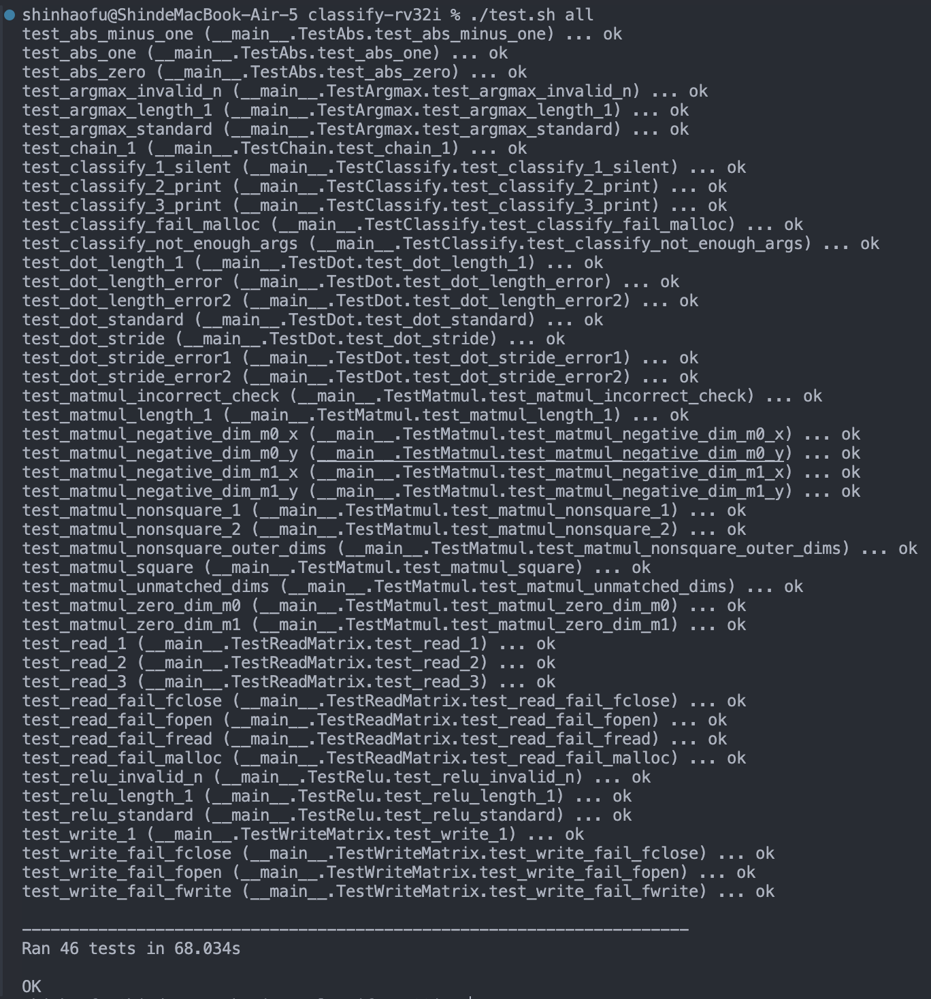

# Assignment 2: Classify

### Part (A)
#### abs.s
    ```assembly
    # My implementation
    sub t0, x0, t0
    sw  t0, 0(a0)
    ```
#### argmax.s
    ```assembly
    # My implementation
    loop_start:
        # TODO: Add your own implementation
        beq  t2, a1, done  
        slli t3, t2, 2
        add  t3, a0, t3
        lw   t3, 0(t3)

        addi t2, t2, 1
        slt  t4, t0, t3 
        beq  t4,  x0, loop_start
        add  t0,  x0, t3
        addi  t1,  t2, -1
        j    loop_start

    done:
        # Epilogue
        add  a0, x0, t1 
        jr ra    
    ```
#### dot.s
``` assembly
    dot:
    # ... ... ... ... ... ... ...
    # ... skip unchanged part ...
    # ... ... ... ... ... ... ...

        # init register
        li t0, 0                # Initialize sum
        li t1, 0                # Initialize counter
        li s0, 0                # Offset for arr0
        li s1, 0                # Offset for arr1
        li s2, 0                # Initialize result accumulator (sum)
        mv s3, a0
        mv s4, a1

    loop_start:
        bge t1, a2, loop_end    # If counter >= element count, exit loop

        slli t2, s0, 2          # Convert offset to byte offset for arr0
        slli t3, s1, 2          # Convert offset to byte offset for arr1

        add t2, s3, t2          # Calculate effective address for arr0[i * stride0]
        add t3, s4, t3          # Calculate effective address for arr1[i * stride1]
        
        lw t2, 0(t2)            # Load value from arr0[i * stride0]
        lw t3, 0(t3)            # Load value from arr1[i * stride1]
        # ### mul a0, t2, t3
        # a0 is result, and it don't need save before call i-mul
        addi sp, sp, -8
        sw ra, 0(sp)
        sw a1, 4(sp)
        
        mv a0, t2               # 將 pass t2 -> a0
        mv a1, t3               # 將 pass t3 -> a1
        
        jal ra, i_mul           # Call i_mul to multiply a0 and a1
        add s2, a0, s2          # Accumulate result
        
        lw ra, 0(sp)
        lw a1, 4(sp)

        addi sp, sp, 8
        # ### 
        addi t1, t1, 1          # Increment loop counter
        add s0, s0, a3          # Update offset for arr0
        add s1, s1, a4          # Update offset for arr1
        
        j loop_start            # Repeat loop

    loop_end:
        mv a0, s2               # Store final sum in a0

        # Restore saved registers before return
        lw ra, 0(sp)
        lw s0, 4(sp)
        lw s1, 8(sp)
        lw s2, 12(sp)
        lw s3, 16(sp)
        lw s4, 20(sp)

        addi sp, sp, 24         # Deallocate stack space
        jr ra                   # Return from function
        
    # ... ... ... ... ... ... ...
    # ... skip unchanged part ...
    # ... ... ... ... ... ... ...

    
    # Multiplication
    i_mul:
        addi sp,sp, -16
        sw s0, 0(sp)
        sw s1, 4(sp)
        sw s2, 8(sp)
        sw s3, 12(sp)

        
        mv s0, a0            # s0 = multiplicand (value of a0)
        mv s1, a1            # s1 = multiplier (value of a1)
        addi a0, x0, 0             # Initialize result to 0

    multiply_loop:
        andi s3, s1, 1       # Check if the least significant bit of s1 is 1
        beq s3, x0, skip_add # If LSB is 0, skip addition
        add a0, a0, s0      # Add s2 to result if LSB is 1

    skip_add:
        slli s0, s0, 1       # left shift s0 (multiplicand) by 1 (x2) 
        srli s1, s1, 1       # right shift s1 (multiplier) by 1 (>>1)
        bnez s1, multiply_loop  # Repeat loop if s is not zero

    end_mul:
        # Restore registers in i_mul
        lw s0, 0(sp)
        lw s1, 4(sp)
        lw s2, 8(sp)
        lw s3, 12(sp)

        addi sp,sp, 16

        jr ra

```
#### relu.s
```assembly
    relu:
    
    # ... ... ... ... ... ... ...
    # ... skip unchanged part ...
    # ... ... ... ... ... ... ...

    loop_start:

        # TODO: Add your own implementation
        beq  t1, a1, done  # if t1 to end, done
        slli t2, t1, 2   # index offset -> byte offset

        add  t2, a0, t2  # t2 = address of a[i+idx]
        lw   t3, 0(t2)   # value of a[i+idx]
        
        bge  t3, x0, skip_relu

    relu_start:
        sw   x0, 0(t2)     

    skip_relu:
        addi t1, t1, 1
        j loop_start


    done:
        jr ra
```
#### matmul.s
```assembly

    matmul:

    # ... ... ... ... ... ... ...
    # ... skip unchanged part ...
    # ... ... ... ... ... ... ...
 
    inner_loop_end:
        # TODO: Add your own implementation
        slli t0, a2, 2
        add s3, s3, t0
        addi s0, s0, 1 # add a1 to next row start 
        j outer_loop_start

    outer_loop_end:
        lw ra, 0(sp)
        lw s0, 4(sp)
        lw s1, 8(sp)
        lw s2, 12(sp)
        lw s3, 16(sp)
        lw s4, 20(sp)
        lw s5, 24(sp)
        addi sp, sp, 28

        jr ra

```
### Part (B)
#### write_matrix.s, read_matrix.s, classify.s

There are several `mul` operations that need to be implemented without using the `mul` instruction. We created a custom multiplication function (`i_mul`). Depending on the registers used to store values, we may need to move them to `s0` and `s1`, with the return value in `a0`.

Before calling `i_mul`, if `a0` and `a1` are already in the required registers, you don’t need to save them before the call. Otherwise, save the necessary registers before calling `i_mul`.

For example, in `write_matrix.s`:

```assembly
    write_matrix:    

        # ... (skipping unchanged parts) ...

        # Original: mul s4, s2, s3   # s4 = total elements
        # FIXME: Replace 'mul' with custom implementation
        addi sp, sp, -12
        sw ra, 0(sp)
        sw a0, 4(sp)
        sw a1, 8(sp)

        mv a0, s2
        mv a1, s3
        jal ra, i_mul   # Call multiplication (i_mul)
        mv s4, a0

        lw ra, 0(sp)
        lw a0, 4(sp)
        lw a1, 8(sp)

        # ... (skipping unchanged parts) ...

    # Multiplication
    i_mul:
        addi sp, sp, -16
        sw s0, 0(sp)
        sw s1, 4(sp)
        sw s2, 8(sp)
        sw s3, 12(sp)

        mv s0, a0            # s0 = multiplicand (value of a0)
        mv s1, a1            # s1 = multiplier (value of a1)
        addi a0, x0, 0       # Initialize result to 0

    multiply_loop:
        andi s3, s1, 1       # Check if the least significant bit of s1 is 1
        beq s3, x0, skip_add # If LSB is 0, skip addition
        add a0, a0, s0       # Add s0 to result if LSB is 1

    skip_add:
        slli s0, s0, 1       # Left shift s0 (multiplicand) by 1
        srli s1, s1, 1       # Right shift s1 (multiplier) by 1
        bnez s1, multiply_loop  # Repeat loop if s1 is not zero

    end_mul:
        # Restore registers in i_mul
        lw s0, 0(sp)
        lw s1, 4(sp)
        lw s2, 8(sp)
        lw s3, 12(sp)
        addi sp, sp, 16

        jr ra
```
For example, in `classify.s` before call i-mul(codeline 342~353):

```assembly
    classify:    

        # ... (skipping unchanged parts) ...

        # FIXME: Replace 'mul' with your own implementation
        # Original: mul a1, t0, t1  # Load the length of array into the second argument
        # Note: Before calling i_mul, save `a0` to the stack if it holds important data, but `a1` does not need saving here
        
        addi sp, sp, -8        # Allocate space on the stack for saving registers
        sw ra, 0(sp)           # Save return address to the stack
        sw a0, 4(sp)           # Save a0, as it will be overwritten by i_mul

        mv a0, t0              # Move multiplicand (t0) to a0, which is the expected input for i_mul
        mv a1, t1              # Move multiplier (t1) to a1, which is also expected by i_mul
        jal ra, i_mul          # Call i_mul function to perform multiplication
        mv a1, a0              # Move the result from a0 to a1 (or any other register as needed)

        lw ra, 0(sp)           # Restore return address
        lw a0, 4(sp)           # Restore original value of a0
        addi sp, sp, 8         # Deallocate stack space

        # ... (skipping unchanged parts) ...

    # Multiplication function (i_mul) 
    # codeline 454~483
    i_mul:
        addi sp, sp, -16       # Allocate stack space to save registers used in this function
        sw s0, 0(sp)           # Save s0
        sw s1, 4(sp)           # Save s1
        sw s2, 8(sp)           # Save s2
        sw s3, 12(sp)          # Save s3

        mv s0, a0              # Move a0 (multiplicand) to s0
        mv s1, a1              # Move a1 (multiplier) to s1
        addi a0, x0, 0         # Initialize result (a0) to 0

    multiply_loop:
        andi s3, s1, 1         # Check if the least significant bit of s1 is 1
        beq s3, x0, skip_add   # If LSB is 0, skip addition
        add a0, a0, s0         # If LSB is 1, add s0 (multiplicand) to result (a0)

    skip_add:
        slli s0, s0, 1         # Left shift s0 (multiplicand) by 1 (multiply by 2)
        srli s1, s1, 1         # Right shift s1 (multiplier) by 1 (divide by 2)
        bnez s1, multiply_loop # Repeat loop if s1 is not zero

    end_mul:
        # Restore registers saved at the start of i_mul
        lw s0, 0(sp)           # Restore s0
        lw s1, 4(sp)           # Restore s1
        lw s2, 8(sp)           # Restore s2
        lw s3, 12(sp)          # Restore s3
        addi sp, sp, 16        # Deallocate stack space

        jr ra                  # Return from i_mul
```
### Run `./test.sh all` 
